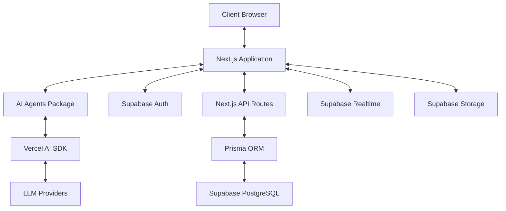

# AI Coding Team Microservices Architecture

## Overview

This document outlines the design for structuring the output of the AI coding team as a complete microservices package that can be easily saved as a repository and integrated into other projects. The architecture follows modern development practices and uses a powerful, scalable tech stack.

## Tech Stack

- **Frontend**: Next.js 15 with App Router and TypeScript
- **UI Component Library**: Shadcn UI with customizable color system
- **Validation**: Zod for runtime type validation
- **AI Integration**: Vercel AI SDK for seamless AI feature development
- **Database & ORM**: Prisma ORM for type-safe database access
- **Backend Services**: Supabase for:
  - Real-time data synchronization
  - Storage capabilities
  - PostgreSQL database
  - Authentication and authorization

## Architecture Design

### 1. Repository Structure

```
ai-dev-team-output/
├── .github/                    # GitHub Actions workflows for CI/CD
├── .vscode/                    # VS Code configuration for consistent development
├── apps/                       # Monorepo apps using Turborepo
│   ├── web/                    # Next.js 15 frontend application
│   └── api/                    # API service (if separate from Next.js API routes)
├── packages/                   # Shared packages
│   ├── ui/                     # Shadcn UI components
│   ├── database/               # Prisma schema and database utilities
│   ├── ai/                     # AI agents and utilities
│   ├── config/                 # Shared configuration
│   ├── types/                  # Shared TypeScript types
│   └── utils/                  # Shared utility functions
├── scripts/                    # Project scripts for development, deployment, etc.
├── .env.example                # Example environment variables
├── docker-compose.yml          # Docker configuration for local development
├── package.json                # Root package.json for managing monorepo
├── pnpm-workspace.yaml         # PNPM workspace configuration
├── turbo.json                  # Turborepo configuration
└── README.md                   # Project documentation
```

### 2. Microservices Components

#### 2.1. Next.js Web Application (apps/web)

The frontend application built with Next.js 15 using the App Router, providing:

- Server components for improved performance
- Client components for interactive features
- API routes for backend functionality
- Integration with Supabase and Vercel AI SDK

#### 2.2. Shared UI Components (packages/ui)

A library of reusable UI components built with Shadcn UI:

- Consistent design language across the application
- Customizable color system
- Accessible and responsive components
- Type-safe component props with TypeScript

#### 2.3. Database Layer (packages/database)

Manages database interactions using Prisma ORM:

- Type-safe database queries
- Schema definition and migrations
- Database seeding utilities
- Integration with Supabase PostgreSQL

#### 2.4. AI Service (packages/ai)

Encapsulates AI functionality using Vercel AI SDK:

- Specialized agent definitions
- Prompt engineering utilities
- Tool integrations for agents
- Streaming response handling

#### 2.5. Configuration (packages/config)

Shared configuration for consistent development:

- ESLint configuration
- TypeScript configuration
- Prettier configuration
- Build and bundling settings

### 3. Data Flow Architecture



### 4. Key Features

#### 4.1. Modular Agent System

The AI coding team is structured as composable, specialized agents:

- Each agent is a separate module with well-defined responsibilities
- Agents can be easily composed for complex tasks
- New agent types can be added without modifying existing ones
- Shared utilities for common agent tasks

#### 4.2. Real-time Collaboration

Built-in support for real-time collaboration using Supabase Realtime:

- Presence indicators showing active users
- Real-time updates of code changes
- Collaborative editing capabilities
- Event broadcasting for system notifications

#### 4.3. Persistent Storage

Integrated storage solution with Supabase Storage:

- Code artifact storage
- Project resource management
- Versioning support
- Access control integration with authentication

#### 4.4. Authentication and Authorization

Comprehensive user management with Supabase Auth:

- Multiple authentication methods (email, social, etc.)
- Role-based access control
- Fine-grained permissions
- JWT token management

#### 4.5. Type Safety

End-to-end type safety across the entire application:

- TypeScript for frontend and backend code
- Zod for runtime validation
- Prisma for type-safe database queries
- Type-safe API routes and client calls

## Implementation Plan

### Phase 1: Foundation Setup

1. Initialize monorepo structure with Turborepo
2. Set up Next.js 15 with App Router and TypeScript
3. Configure Shadcn UI components
4. Establish Prisma ORM connection to Supabase
5. Set up authentication with Supabase Auth

### Phase 2: Core Services

1. Implement database schema and migrations
2. Build shared UI component library
3. Set up API routes for core functionality
4. Integrate Vercel AI SDK with agent system
5. Implement basic AI agent functionality

### Phase 3: Advanced Features

1. Implement real-time collaboration features
2. Add storage functionality for code artifacts
3. Enhance AI agents with specialized capabilities
4. Build dashboard for monitoring and management
5. Implement advanced prompt engineering

### Phase 4: Optimization and Packaging

1. Optimize performance with caching strategies
2. Implement comprehensive error handling
3. Add thorough documentation
4. Create deployment scripts
5. Package for easy installation in other projects

## Integration Guide

To integrate this microservices package into another project:

1. Clone the repository
2. Configure environment variables
3. Run initialization script
4. Connect to your Supabase instance
5. Customize agent behaviors as needed

## Example Implementation

Below is a simplified example of how the AI agent system would be implemented:

```typescript
// packages/ai/src/agents/index.ts
import { createAI, createStreamableUI } from 'ai/rsc';
import { openai } from '@/lib/openai';
import { SpecializedAgent } from './specialized-agent';
import { createAgentRegistry } from './registry';

export const aiAgents = createAI({
  actions: {
    submitQuery: async (query: string, context: any) => {
      const agentRegistry = createAgentRegistry();
      const currentAgent = agentRegistry.getDefaultAgent();
      
      // Process the query with the current agent
      const response = await currentAgent.processQuery(query, context);
      
      // Check for handoff conditions
      const handoffAgent = currentAgent.checkForHandoff(response);
      if (handoffAgent) {
        // Perform handoff to specialized agent
        return handoffAgent.processQuery(query, {...context, handoffContext: response});
      }
      
      return createStreamableUI(
        <div className="agent-response">
          {response}
        </div>
      );
    }
  }
});
```

## Conclusion

This microservices architecture provides a flexible, scalable foundation for deploying the AI coding team's output as a complete package. By leveraging modern technologies like Next.js 15, Vercel AI SDK, Shadcn UI, Prisma ORM, and Supabase, the system offers a powerful yet developer-friendly experience that can be easily extended and integrated into existing projects.

The modular nature of the architecture allows for easy customization and extension, making it suitable for a wide range of applications in the construction technology domain and beyond. 